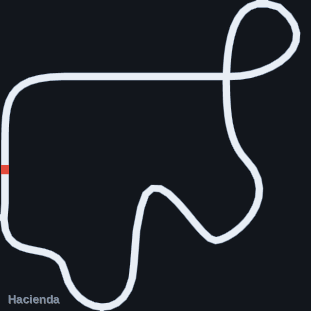
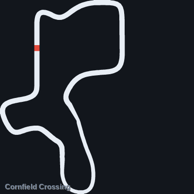
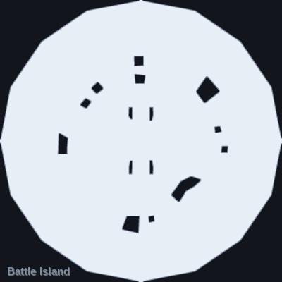
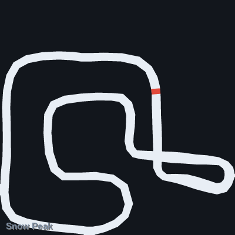
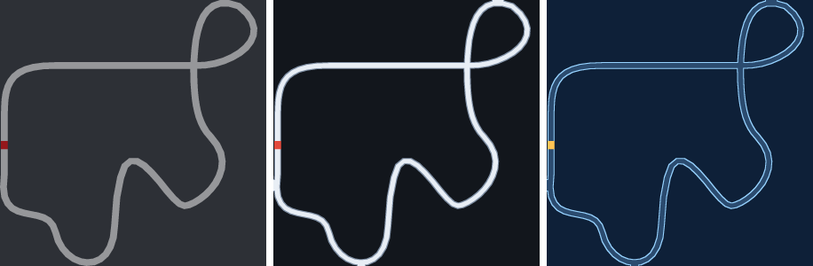

# STK Minimap

Render any SuperTuxKart track's minimap to a PNG — the same image the game
builds for the corner of your screen, but offline, at any resolution.

<p align="center">
  
</p>

SuperTuxKart doesn't ship minimap images. There is no file to extract: the game
builds the minimap at track load time from the track's AI graph, uploads it to a
texture, and throws it away when you quit. This script reimplements that path in
software, so you can get the image without running the game.

Useful if you're making route diagrams, split overlays, track guides, or
anything that needs to draw on top of the in-game minimap — `--style exact`
reproduces the game's texture exactly, so overlays line up pixel for pixel.

<p align="center">
  
  
  
</p>

---

## Quick start

You need **Python 3.9+** and **Pillow**. NumPy is optional but recommended (it
makes the downscaling alpha-correct and a bit sharper).

### Windows

1. Install Python from [python.org](https://www.python.org/downloads/) — tick
   **"Add python.exe to PATH"** during setup.
2. Open Command Prompt and run:
   ```
   pip install pillow numpy
   ```
3. Download `stk_minimap.py` (and `STK Minimap.pyw`, optional) from this repo.
4. **Double-click `stk_minimap.py`** — the window opens and finds your tracks by
   itself. Double-click `STK Minimap.pyw` instead if you'd rather not have a
   console window behind it.

### Linux

```bash
sudo pacman -S python-pillow python-numpy tk      # Arch / Manjaro
sudo apt install python3-pil python3-numpy python3-tk python3-pil.imagetk   # Debian / Ubuntu
sudo dnf install python3-pillow python3-numpy python3-tkinter               # Fedora

chmod +x stk_minimap.py
./stk_minimap.py --gui
```

### macOS

```bash
pip3 install pillow numpy
python3 stk_minimap.py --gui
```

`tk` / `python3-tk` is only needed for the GUI — the command line works without
it.

---

## The window

`--gui`, or just double-click the script on Windows.

Pick a track from the list on the left and the preview updates immediately.
Set the style, output size and quality, tick what you want drawn, then
**Save PNG…**. **Save every track…** batches the whole list into a folder.

If your tracks aren't found automatically, **Add folder…** points it at any
directory of tracks, and **Open .zip…** takes an addon archive as downloaded
from the STK add-ons site.

Transparent `exact` renders are previewed over a checkerboard, otherwise they'd
look like an empty box.

---

## Command line

```bash
./stk_minimap.py hacienda                        # -> hacienda_minimap.png
./stk_minimap.py hacienda --style clean --title  # readable, with the track name
./stk_minimap.py battleisland -s 1024            # 1024x1024
./stk_minimap.py --list                          # what can I render?
./stk_minimap.py --all -O ./minimaps --style clean    # everything, into a folder
./stk_minimap.py ~/Downloads/mytrack.zip --style clean    # an addon archive
./stk_minimap.py /path/to/some/track_folder      # an unpacked track
```

`--list` on a stock SuperTuxKart 1.5 install finds 44 tracks; 38 of them have a
graph to render (the other six are cutscenes and grand-prix result screens,
which have no driveline).

### Options

| Flag | What it does |
|---|---|
| `-o, --output` | output file (default `<ident>_minimap.png`) |
| `-O, --output-dir` | where `--all` writes |
| `-s, --size` | output size in pixels, default 512 |
| `--style` | `exact`, `clean` or `blueprint` |
| `--background` | override the background, e.g. `'#101418'` or `none` |
| `--outline` | outline width in pixels (`clean`/`blueprint`) |
| `--title` | draw the track's display name |
| `--supersample` | antialiasing factor, default 4 (the game itself uses 2) |
| `--fit` | crop to the track instead of the game's square view |
| `--margin` | padding fraction, `--fit` only |
| `--reverse` | reverse mode — honours `direction="forward\|reverse"` quads |
| `--show-invisible` | also draw quads the game hides |
| `--invert-x-z` | mirror X and Z, as the game does for the blue soccer team |
| `--full-polys` | navmesh: draw >4-sided faces in full (the game truncates them) |
| `--data-dir` | extra directory to search, repeatable |
| `--no-seal` | don't weld hairline gaps between quads |
| `--gui` | open the window |

---

## Styles

<p align="center">
  
</p>

**`exact`** (default) — what the game actually renders: white at alpha 127 on a
fully transparent background. On its own it looks blank in most image viewers;
that's correct, and it's the one to use if you're compositing over the in-game
minimap. Shown above over grey so you can see it at all.

**`clean`** — light track on a dark background with an outline. What you want
for a guide, a diagram, or a Discord post.

**`blueprint`** — the same geometry in a schematic blue.

`clean` and `blueprint` are cosmetic and may change between versions. `exact` is
a contract and won't.

---

## Drawing on top of the minimap

The `exact` style reproduces the game's framing, so the mapping from world
coordinates to pixels is the same one the game uses to place the kart markers
(`Graph::mapPoint2MiniMap`):

```
px = (world_x - origin_x) * scaling
py = height - (world_z - origin_z) * scaling      # PNG rows count from the top
```

The script prints those three numbers for you:

```
$ ./stk_minimap.py hacienda
Hacienda  [hacienda]  driveline
  quads      : 109 (109 visible)
  bbox       : x -5.11..302.39   y -20.99..9.01   z -140.00..178.27
  scaling    : 1.60872 px per world unit
  world->px  : px = (x - -5.107) * 1.60872
               py = 512 - (z - -139.999) * 1.60872
```

So a kart at world `(150, ?, 20)` on a 512px Hacienda minimap sits at
`((150 + 5.107) * 1.60872, 512 - (20 + 139.999) * 1.60872)` = `(249.5, 254.6)`.

Two things to know:

- **Height (`y`) is ignored.** The minimap is a flat top-down projection.
- **Non-square tracks get empty padding on one side.** The game's orthographic
  box is square — `range = max(width, depth)` — and it's deliberately anchored
  so that the mapping above stays a plain affine transform. That padding is
  faithful, not a bug. `--fit` crops it away, and doing so **breaks the
  mapping**, so don't use `--fit` for overlays.

---

## Where it looks for tracks

Windows
- `C:\Program Files\SuperTuxKart*\data\tracks` (and the x86 / `PROGRAMW6432` variants)
- `%APPDATA%\supertuxkart\addons\tracks` — tracks you downloaded in-game
- Steam libraries, found by reading `steamapps\libraryfolders.vdf`
- portable zips extracted to Desktop, Downloads, Documents, Games, `C:\`, `D:\`
- a `data\tracks` folder next to the script, so you can drop it into the game folder

Linux
- `/usr/share/supertuxkart/data/tracks` and the usual `/usr/local`, `/opt`,
  `/usr/share/games` variants
- `~/.local/share/supertuxkart/addons/tracks`, `~/.supertuxkart/addons/tracks`
- Flatpak and Snap locations, Steam libraries
- `~/*/stk-assets/tracks` for source checkouts

macOS
- `/Applications/SuperTuxKart*.app/Contents/Resources/data/tracks`
- `~/Library/Application Support/SuperTuxKart/addons/tracks`, Steam libraries

If none of that matches your setup, set `STK_TRACK_DIR` or pass `--data-dir`:

```bash
STK_TRACK_DIR="/somewhere/else/tracks" ./stk_minimap.py --list
./stk_minimap.py --data-dir "/somewhere/else/tracks" --list
```

---

## How faithful is it?

This is a reimplementation of `Graph::makeMiniMap` and its callees from
[stk-code](https://github.com/supertuxkart/stk-code) (`src/tracks/graph.cpp`,
`drive_graph.cpp`, `arena_graph.cpp`, `quad.cpp`). Race tracks are read from
`quads.xml` (the driveline graph), arenas and soccer fields from `navmesh.xml`.

Behaviours that are reproduced on purpose, because getting any of them wrong
shifts or distorts the image:

- The bounding box includes **invisible** quads — the game grows it in
  `createQuad`, before any visibility filtering.
- The orthographic box is square and offset toward the shorter axis, anchoring
  the track at the bounding-box minimum on both axes.
- Overlapping quads **overwrite** rather than blend, because the game's material
  is opaque.
- The lap line is node 0's quad, shortened to 3% of the track's Z extent, drawn
  in red — and only for race tracks, never arenas.
- `p0="3:2"` in `quads.xml` means "point 2 of quad 3"; most quads share an edge
  with their neighbour this way.
- Navmesh faces aren't always four-sided. The game reads the first four indices
  unconditionally, so this does too; `--full-polys` opts out.

Rendering is supersampled and resolved with a premultiplied box filter, which
keeps `exact` landing on alpha 127 exactly. (Lanczos rings past 127 and breaks
that guarantee, so it's only used as a fallback when NumPy isn't installed.)

If you want to change any of that, read [docs/NOTES.md](docs/NOTES.md) first — it
records the research behind these decisions and the traps in reproducing them.

### Known gaps

- Soccer goal-line node colouring (`ArenaGraph::differentNodeColor`) isn't
  implemented — it needs a Dijkstra pass over the navmesh.
- CTF flag bounding-box expansion isn't implemented.
- `height-testing` elements are parsed and ignored; they only affect physics.
- Only the `default` `<mode>` from `track.xml` is honoured.

---

## Troubleshooting

**The PNG looks blank / empty.** That's `--style exact` doing its job — it's
white at alpha 127 on a transparent background, so a white image viewer shows
nothing. Use `--style clean`, or `--background '#101418'`.

**"No tracks found."** Pass `--data-dir /path/to/tracks`, set `STK_TRACK_DIR`,
or use **Add folder…** in the GUI. Run `--list` to see which directories were
searched.

**"The GUI needs tkinter."** Install it: `sudo pacman -S tk` (Arch),
`sudo apt install python3-tk python3-pil.imagetk` (Debian/Ubuntu),
`sudo dnf install python3-tkinter` (Fedora). Windows and macOS builds from
python.org already include it. The command line works without it.

**Hairline gaps between sections of track.** The game nudges every quad along
its own surface normal, so on sloped ground neighbours can miss each other by a
sliver. `clean` and `blueprint` weld those shut; `exact` deliberately doesn't,
to stay pixel-faithful. `--no-seal` turns the welding off.

---

## Credits

SuperTuxKart is made by the [SuperTuxKart team](https://supertuxkart.net/); all
the track data and the minimap algorithm are theirs. This is an independent tool
and isn't affiliated with or endorsed by the project.

Licensed under the **GPL-3.0**, the same licence as SuperTuxKart's code — see
[LICENSE](LICENSE).
