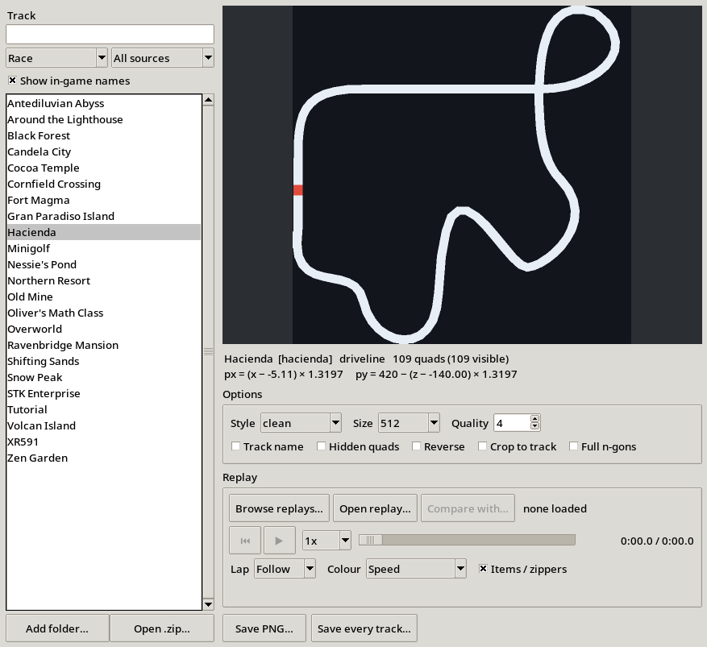
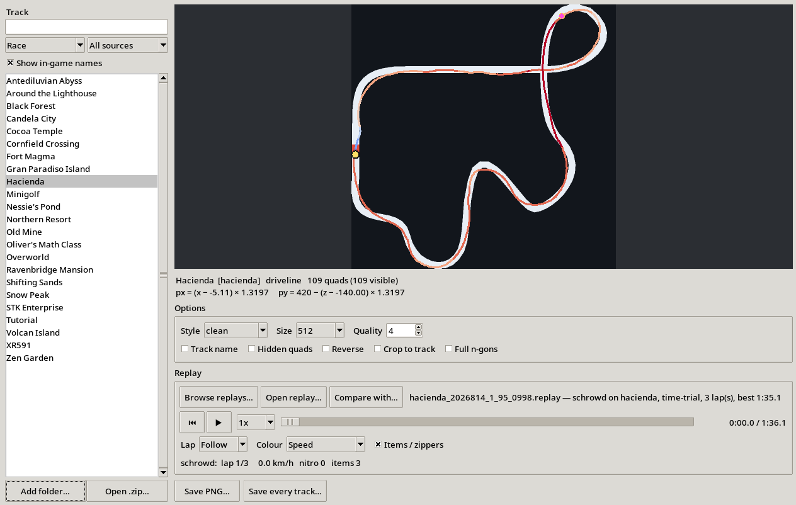

# STK Minimap

Render any SuperTuxKart track's minimap to a PNG - and play your replays back
on top of it.

<p align="center">
  
</p>

Two things, built on the same piece of machinery.

**Maps.** SuperTuxKart doesn't ship minimap images. There's no file to extract:
the game builds one at track load from the track's AI graph, uses it, and throws
it away when you quit. This rebuilds them offline, at any resolution. `--style
exact` reproduces the game's own texture pixel for pixel, so anything you draw
on top lines up with what's on screen in game.

**Replays.** Load a `.replay` and watch the run draw itself across that map,
coloured by speed so the slow sections are obvious, with nitro and skid charge
marked as they happen. Put two runs side by side and read the gap between them
at any point on the track. The world records that ship with SuperTuxKart 1.5
are already in the list, so lining your run up against one takes a few clicks.

Useful for route diagrams, track guides, split overlays, and working out where
a run is actually losing time.

<p align="center">
  
  
  
</p>

---

## Quick start

You need **Python 3.9+** and **Pillow**. NumPy is optional but recommended (it
makes the downscaling alpha-correct and a bit sharper). There's nothing to
install beyond that - `stk_minimap` is a plain Python package, run in place;
clone or download this repo and run it with `python3 -m stk_minimap` from the
repo root.

### Windows

1. Install Python from [python.org](https://www.python.org/downloads/) - tick
   **"Add python.exe to PATH"** during setup.
2. Open Command Prompt and run:
   ```
   pip install pillow numpy
   ```
3. Download this repo (**Code → Download ZIP** on GitHub, or `git clone`) and
   unzip it.
4. **Double-click `STK Minimap.pyw`** inside the folder - the window opens and
   finds your tracks by itself, with no console window behind it. (The `.pyw`
   trick is Windows-only - the extension has no effect on Linux or macOS.)

### Linux

```bash
sudo pacman -S python-pillow python-numpy tk      # Arch / Manjaro
sudo apt install python3-pil python3-numpy python3-tk python3-pil.imagetk   # Debian / Ubuntu
sudo dnf install python3-pillow python3-numpy python3-tkinter               # Fedora

python3 -m stk_minimap --gui
```

To get a clickable launcher instead of typing that every time:

```bash
python3 -m stk_minimap --install-desktop
```

**STK Minimap** then appears in your applications list, searchable and
pinnable, and opens the window with no terminal involved.

This is the only way to launch it by clicking on modern GNOME: Files removed
the ability to run executable text files, so double-clicking a `.py` opens it
in a text editor and there's no setting to change that. Undo it by deleting
`~/.local/share/applications/stk-minimap.desktop`.

### macOS

```bash
pip3 install pillow numpy
python3 -m stk_minimap --gui
```

`tk` / `python3-tk` is only needed for the GUI; the command line works without
it.

---

## The window

`--gui`, or just double-click `STK Minimap.pyw` on Windows.

<p align="center">
  
</p>

Pick a track from the list on the left and the preview updates immediately.
Filter it by **type** (race, arena, soccer) and by **source** (built-in or
add-ons), tick **Show in-game names** to list them as *Antediluvian Abyss*
rather than `abyss`, and search either form. Cutscenes and grand-prix screens
are left out: they carry no graph, so there's nothing to draw.

Those three settings are remembered between runs, in
`%APPDATA%\stk-minimap\settings.json` on Windows or
`~/.config/stk-minimap/settings.json` elsewhere. Delete that file to start
fresh; nothing else is stored, and the tool works fine if it can't be written.

Set the style, output size and quality, tick what you want drawn, then
**Save PNG…**. **Save every track…** batches the whole list into a folder.

If your tracks aren't found automatically, **Add folder…** points it at any
directory of tracks, and **Open .zip…** takes an addon archive as downloaded
from the STK add-ons site.

Transparent `exact` renders are previewed over a checkerboard, otherwise they'd
look like an empty box.

---

## Replays

**Browse replays…** lists every replay on your machine in a sortable table -
your own runs *and* the 21 world records and challenge ghosts that ship with
SuperTuxKart 1.5. Click any column to sort:

| Column | |
|---|---|
| **Track** | in-game name; flags anything whose track isn't installed |
| **Time** | the run's time, fastest first by default |
| **Laps**, **Driver** | from the replay header |
| **Date** | when the run was set, read from STK's filename (the shipped records all share a packaging date, so their file timestamps are useless) |
| **Source** | World record, Ghost, Challenge, or Yours |

**Show** narrows it to one source, and the search box matches track, driver or
filename. Selecting a run shows its description underneath; that's how you
tell a current world record from a former one. **Load** opens it; double-click
does the same.

So the (sometimes former) world record run of any track is two clicks away:
**Browse replays…**, **Show → World record**.

**Open replay…** takes a `.replay` file from anywhere if you'd rather pick it
by hand.

<p align="center">
  
</p>

Press **▶** to play, drag the slider to scrub or rewind, and pick a rate from
`0.1x` to `4x` to crawl through a corner in slow motion. The live readout shows
the lap, speed in km/h, nitro in hand, items held, and which of nitro/skid/
zipper is active on the current frame.

**Lap** decides how much of the run is drawn. A three-lap run stacked on one
piece of track is unreadable, so the default is **Follow**: only the lap the
playhead is in. Pick **All** for the whole run, or a specific lap to compare
one against another.

**Colour** picks *one* thing to show, rather than layering them:

| Mode | Draws |
|---|---|
| **Speed** | blue where you're slow through to red where you're quick - where a run loses time, at a glance |
| **Nitro & skid** | a dim route, cyan where nitro was burning, yellow and red where a skid was charged |
| **Plain** | just the line |

**Items / zippers** adds a yellow ring where a zipper fired and a pink diamond
where an item was used.

### Reading the kart marker

The marker carries two rings, so you can see what the kart is doing at the
moment it does it:

| Ring | Meaning |
|---|---|
| **Black**, close in | skidding, not yet charged |
| **Yellow**, close in | yellow skid earned |
| **Red**, close in | red skid earned |
| **Cyan**, further out | nitro burning |

The marker is an arrow showing which way the kart is **pointing**, taken from
the orientation stored in the replay. That isn't the same as the way it's
moving: the difference is the slip angle, and it's the thing you can't see from
a dot. On a straight it's essentially zero; through a charged red skid the kart
runs about 25° sideways to its own direction of travel. Watching the arrow swing
out and come back is watching the drift.

Karts are drawn slightly smaller each, so when two runs are on the same corner -
or exactly on top of each other, as they are at the start - the larger one's rim
stays visible around the smaller one and you can still see both.

Positions are interpolated between recorded frames. Replays only store about 15
frames a second with gaps up to 100ms, so without it the marker would sit still
and then jump several metres; the game interpolates ghost positions for the same
reason.

The rings are at different radii, so a red skid while on nitro shows both at once.
The skid charge comes from the replay's own `skidding_effect` column, which
steps up as you hold the skid - the same thing that turns the sparks yellow
then red in game.

### Comparing two runs

**Compare with…** opens the browser again to pick the second run, already
narrowed to the track you're on; only same-track runs can be compared. Both
then play together as run **A** and run **B**, each with its own colour, marker
and readout line. (**Pick a file…** in the browser takes a `.replay` from
anywhere, for either slot.)

Underneath them is the gap:

```
Δ  B behind by 7.03s at this point on track
```

That's the difference measured **at the same place on the track**, not at the
same moment in time - the same thing a ghost shows you. Positions at the same
timestamp only tell you who's further ahead; the time difference at a given
corner is what tells you where a run was actually won or lost. Scrub through
and watch the number grow or shrink to find the sections that cost you.

Both runs must be on the same track, or it'll say so rather than compare
nonsense. Loading a new run into **A** clears the comparison.

The obvious use: load a world record as **A**, then **Browse replays…** →
**Compare with loaded run** on your own attempt, and scrub through to see
exactly which corners the record is taking better.

Replays with more than one kart - a run recorded against a ghost - already
contain two karts, and are drawn the same way.

The map has to match the replay: opening one selects its track for you, and if
that track isn't installed it'll say so rather than draw the run on the wrong
map.

### When a shortcut goes off the map

Some tracks have shortcuts that leave the area STK actually built the minimap
from - Cocoa Temple's is the one that turns this up, but it isn't the only
one. The route and the kart marker used to just vanish for however long the
run was off that area, since anything drawn outside the canvas is silently
clipped rather than an error. The window and every `--replay` render now grow
the canvas to fit the whole recorded path when this happens, so the shortcut
stays fully visible; you'll see the game-accurate map in its usual position
with a bit of extra canvas around whichever side the shortcut went off. This
only ever triggers when a replay's path genuinely leaves the frame; an
ordinary run never changes the output at all. Implementation and the math
behind it: [docs/NOTES.md](docs/NOTES.md#when-a-replay-leaves-the-driveline-graphs-bounding-box).

### Sector splits

Below the playback controls, the **Splits** panel breaks the loaded run into
sectors using the track's own `activate` check lines: the gates a route has
to cross in order for a lap to count. Each row is a lap; the last row is the
**theoretical best**, the fastest time seen in each sector across every lap in
the file, added up. Only tracks with check lines have this; most stock tracks
do.

**Export splits CSV…** writes that table to a file. **Export telemetry
CSV…** writes the whole recording - position, speed, heading, nitro, skid
level, lap, distance - one row per frame, for anyone who wants to do more with
it than this window shows.

### Keyboard

With a replay loaded: **Space** plays or pauses, **←/→** step one recorded
frame at a time (pausing first, so stepping is predictable), **Home/End** jump
to the start or end. These work regardless of which control last had focus -
clicking the scrub slider, a button, or the splits table won't swallow them.
They don't fire while you're typing in a text box.

### Orientation always matches the game

Once a replay is loaded, **Rotate** locks to 0° and greys out. A rotated view
is genuinely useful for a diagram, but not for a replay; a replay is only
useful if what you're looking at is trustworthy against what actually
happened, so there's no way to leave one rotated by accident. `--invert-x-z`
(the mirroring the game itself does for the blue soccer team) is threaded
through the same way, for the same reason, though it never applies to a
`.replay` file in practice; ghost replays are time-trial only, and the
mirror is soccer-only.

---

## Live sync with the game (optional)

Everything above works against the SuperTuxKart you already have. This part
needs a **patched** build, and is entirely optional.

With it, the map and the game share one playback head: pause, scrub or slow a
replay in either window and the other follows. Load a replay in-game with
nothing open here, and the map finds that same `.replay` and starts following
it on its own.

Build the patched game with one command:

```bash
./patches/build.sh
```

It clones SuperTuxKart 1.5, applies the four patches in
[`patches/`](patches/), reuses your existing install's tracks and karts rather
than downloading them again, and builds. Then open the **Replay** tab and
press **Launch SuperTuxKart**: the button starts the patched build with the
sync port already set and connects to it, so there's no flag to remember.

The patches are opt-in at runtime too. Without `--sync-port`, a patched build
behaves exactly like the stock game: no socket, no thread, no difference. The
connection is loopback-only and never reachable from another machine.

Two of the four patches are worth having regardless of sync: one fixes replay
rewind being broken (the ghost freezes when the clock moves backwards), and
one fixes a **crash in stock SuperTuxKart 1.5** when watching
`wr_candela_city_202598_1_82_3725.replay`, a world record that ships with the
game. [`patches/README.md`](patches/README.md) has the details and the
verification for all four; [`patches/PROTOCOL.md`](patches/PROTOCOL.md) is the
wire protocol.

---

## Command line

```bash
python3 -m stk_minimap hacienda                        # -> hacienda_minimap.png
python3 -m stk_minimap hacienda --style clean --title  # readable, with the track name
python3 -m stk_minimap battleisland -s 1024            # 1024x1024
python3 -m stk_minimap --list                          # what can I render?
python3 -m stk_minimap --all -O ./minimaps --style clean    # everything, into a folder
python3 -m stk_minimap ~/Downloads/mytrack.zip --style clean    # an addon archive
python3 -m stk_minimap /path/to/some/track_folder      # an unpacked track

python3 -m stk_minimap --replay run.replay                    # route over its map;
                                                          # the track name is
                                                          # read from the file
python3 -m stk_minimap --replay mine.replay --compare wr.replay --checklines
python3 -m stk_minimap --replay run.replay --splits            # sector splits, printed
python3 -m stk_minimap --replay run.replay --csv laps.csv --splits-csv splits.csv
```

`--list` on a stock SuperTuxKart 1.5 install finds 44 tracks; 38 of them have a
graph to render (the other six are cutscenes and grand-prix result screens,
which have no driveline).

### Options

| Flag | What it does |
|---|---|
| `-o, --output` | output file (default `<ident>_minimap.png`) |
| `-O, --output-dir` | where `--all` writes |
| `-s, --size` | output size in pixels, default 512 |
| `--style` | `exact`, `clean` or `blueprint` |
| `--background` | override the background, e.g. `'#101418'` or `none` |
| `--outline` | outline width in pixels; `0` turns it off (default: none for `clean`, 1 for `blueprint`) |
| `--title` | draw the track's display name |
| `--checklines` | draw the track's check lines |
| `--rotate` | turn the map clockwise by N degrees (breaks `mapPoint2MiniMap`) |
| `--supersample` | antialiasing factor, default 4 (the game itself uses 2) |
| `--fit` | crop to the track instead of the game's square view |
| `--margin` | padding fraction, `--fit` only |
| `--reverse` | reverse mode - honours `direction="forward\|reverse"` quads |
| `--show-invisible` | also draw quads the game hides |
| `--invert-x-z` | mirror X and Z, as the game does for the blue soccer team |
| `--full-polys` | navmesh: draw >4-sided faces in full (the game truncates them) |
| `--data-dir` | extra directory to search, repeatable |
| `--no-seal` | don't weld hairline gaps between quads |
| `--gui` | open the window |
| `--install-desktop` | Linux: add a launcher to the applications menu |
| `--version` | print the version |
| `--replay FILE` | overlay a run's route; track can be omitted, it's read from the file |
| `--compare FILE` | overlay a second run alongside `--replay` |
| `--replay-colour` | `speed` (default), `nitro`, or `plain` |
| `--replay-lap` | `all` (default) or a 1-based lap number |
| `--csv FILE` | write `--replay`'s per-frame telemetry to a CSV |
| `--splits` | print `--replay`'s sector splits (needs check lines) |
| `--splits-csv FILE` | write `--replay`'s sector splits to a CSV |

---

## Styles

<p align="center">
  
</p>

**`exact`** (default) - what the game actually renders: white at alpha 127 on a
fully transparent background. On its own it looks blank in most image viewers;
that's correct, and it's the one to use if you're compositing over the in-game
minimap. Shown above over grey so you can see it at all.

**`clean`**: light track on a dark background. What you want for a guide, a
diagram, or a Discord post. Deliberately has no outline: a stroke thinner than
the antialiasing ramp can't survive the downscale as its own colour, so it just
softens the edge instead of defining it. Add one with `--outline 2` if you want
it. **`blueprint`**: the same geometry in a schematic blue; this one keeps its
outline, because its fill is translucent and would barely register without it.

`clean` and `blueprint` are cosmetic and may change between versions. `exact` is
a contract and won't.

---

## Rotating the map

The game's minimap is always oriented the same way, which isn't always the way
you want it on a page. **Rotate** in the window turns the map in 15° steps, and
`--rotate 90` does the same from the command line. Positive angles turn it
clockwise; any angle works, not just multiples of 90. The track, the check
lines and the replay overlay all rotate together.

Rotating **breaks `mapPoint2MiniMap` compatibility**, in the same way `--fit`
does: the pixel mapping is no longer the plain affine transform below. Don't
rotate a map you're going to draw kart positions on with the printed formula.
Why it's a re-framing rather than an image rotation, and what that guarantees:
[docs/NOTES.md](docs/NOTES.md#rotation).

---

## Check lines

`--checklines`, or tick **Check lines** in the window, draws the check
structures from the track's `scene.xml` on top of the map:

| Colour | |
|---|---|
| **Cyan** | `activate` gates - the checkpoints that must be crossed **in order** |
| **Red** | `lap` lines - what actually counts a lap |

This is the geometry that decides whether a shortcut counts. A route that skips
a cyan gate won't validate a lap no matter how fast it is, so seeing where the
gates actually sit tells you which cuts are legal and which only look legal.

29 of the 44 stock tracks define them; Black Forest has 24, Hacienda 9, and some
have none at all. They're an annotation rather than part of the game's texture,
so they're off by default and drawing them takes `--style exact` away from being
a faithful copy of the in-game image.

Lap lines are often much shorter than the gates, so at small sizes they can
render as just a couple of pixels - that's the real geometry, not a rendering
problem. Numbers: [docs/NOTES.md](docs/NOTES.md#check-lines).

---

## Drawing on top of the minimap

The `exact` style reproduces the game's framing, so the mapping from world
coordinates to pixels is the same one the game uses to place the kart markers
(`Graph::mapPoint2MiniMap`):

```
px = (world_x - origin_x) * scaling
py = height - (world_z - origin_z) * scaling      # PNG rows count from the top
```

The script prints those three numbers for you:

```
$ python3 -m stk_minimap hacienda
Hacienda  [hacienda]  driveline
  quads      : 109 (109 visible)
  bbox       : x -5.11..302.39   y -20.99..9.01   z -140.00..178.27
  scaling    : 1.60872 px per world unit
  world->px  : px = (x - -5.107) * 1.60872
               py = 512 - (z - -139.999) * 1.60872
```

So a kart at world `(150, ?, 20)` on a 512px Hacienda minimap sits at
`((150 + 5.107) * 1.60872, 512 - (20 + 139.999) * 1.60872)` = `(249.5, 254.6)`.

Two things to know:

- **Height (`y`) is ignored.** The minimap is a flat top-down projection.
- **Non-square tracks get empty padding on one side** - faithful, not a bug;
  why: [docs/NOTES.md](docs/NOTES.md#how-stk-actually-builds-a-minimap).
  `--fit` crops it away, and doing so **breaks the mapping**, so don't use
  `--fit` for overlays.

---

## Where it looks for tracks

Windows
- `C:\Program Files\SuperTuxKart*\data\tracks` (and the x86 / `PROGRAMW6432` variants)
- `%APPDATA%\supertuxkart\addons\tracks` - tracks you downloaded in-game
- Steam libraries, found by reading `steamapps\libraryfolders.vdf`
- portable zips extracted to Desktop, Downloads, Documents, Games, `C:\`, `D:\`
- a `data\tracks` folder next to the `stk_minimap` folder, so you can drop this whole repo into the game folder

Linux
- `/usr/share/supertuxkart/data/tracks` and the usual `/usr/local`, `/opt`,
  `/usr/share/games` variants
- `~/.local/share/supertuxkart/addons/tracks`, `~/.supertuxkart/addons/tracks`
- Flatpak and Snap locations, Steam libraries
- `~/*/stk-assets/tracks` for source checkouts

macOS
- `/Applications/SuperTuxKart*.app/Contents/Resources/data/tracks`
- `~/Library/Application Support/SuperTuxKart/addons/tracks`, Steam libraries

Replays are looked for in two places on every platform: the folder STK records
into (`%APPDATA%\supertuxkart\replay` on Windows,
`~/.local/share/supertuxkart/replay` on Linux,
`~/Library/Application Support/SuperTuxKart/replay` on macOS), and the `replay`
folder that sits next to the `tracks` folder of whichever install was found
above - which is where the shipped world records live. Pointing the tool at a
different install with `--data-dir` picks up that install's records too.

If none of that matches your setup, set `STK_TRACK_DIR` or pass `--data-dir`:

```bash
STK_TRACK_DIR="/somewhere/else/tracks" python3 -m stk_minimap --list
python3 -m stk_minimap --data-dir "/somewhere/else/tracks" --list
```

---

## How faithful is it?

This is a reimplementation of `Graph::makeMiniMap` and its callees from
[stk-code](https://github.com/supertuxkart/stk-code) (`src/tracks/graph.cpp`,
`drive_graph.cpp`, `arena_graph.cpp`, `quad.cpp`) - not just visually similar,
pixel-for-pixel where it claims to be (`--style exact`). The behaviours it
reproduces on purpose and why each one matters, the rendering pipeline that
keeps `exact` landing on alpha 127 exactly, and what still isn't implemented
(soccer goal-line colouring, CTF flag bounding-box expansion, a couple of
others) are all in
[docs/NOTES.md](docs/NOTES.md#how-stk-actually-builds-a-minimap) - read that
before changing any of it.

---

## Troubleshooting

**The PNG looks blank / empty.** That's `--style exact` doing its job: it's
white at alpha 127 on a transparent background, so a white image viewer shows
nothing. Use `--style clean`, or `--background '#101418'`.

**"No tracks found."** Pass `--data-dir /path/to/tracks`, set `STK_TRACK_DIR`,
or use **Add folder…** in the GUI. Run `--list` to see which directories were
searched.

**"The GUI needs tkinter."** Install it: `sudo pacman -S tk` (Arch),
`sudo apt install python3-tk python3-pil.imagetk` (Debian/Ubuntu),
`sudo dnf install python3-tkinter` (Fedora). Windows and macOS builds from
python.org already include it. The command line works without it.

**Hairline gaps between sections of track.** The game nudges every quad along
its own surface normal, so on sloped ground neighbours can miss each other by a
sliver. `clean` and `blueprint` weld those shut; `exact` deliberately doesn't,
to stay pixel-faithful. `--no-seal` turns the welding off.

---

## Credits

SuperTuxKart is made by the [SuperTuxKart team](https://supertuxkart.net/); all
the track data and the minimap algorithm are theirs. This is an independent tool
and isn't affiliated with or endorsed by the project.

Licensed under the **GPL-3.0**, the same licence as SuperTuxKart's code; see
[LICENSE](LICENSE).
